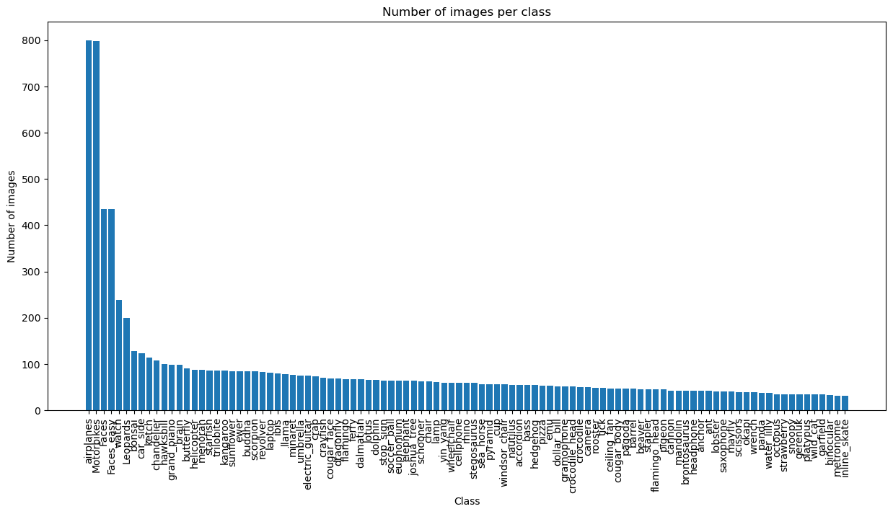
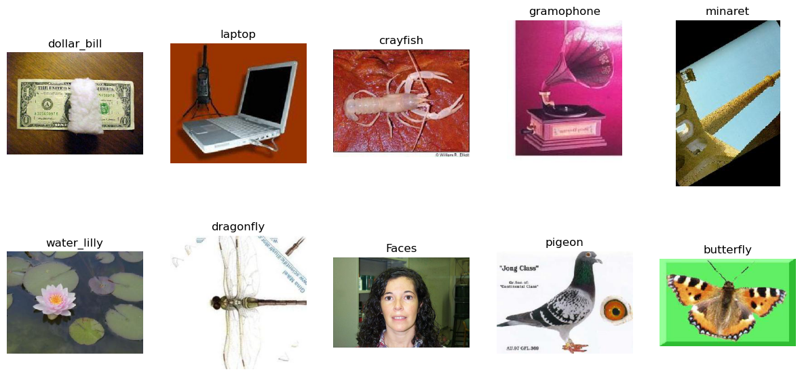
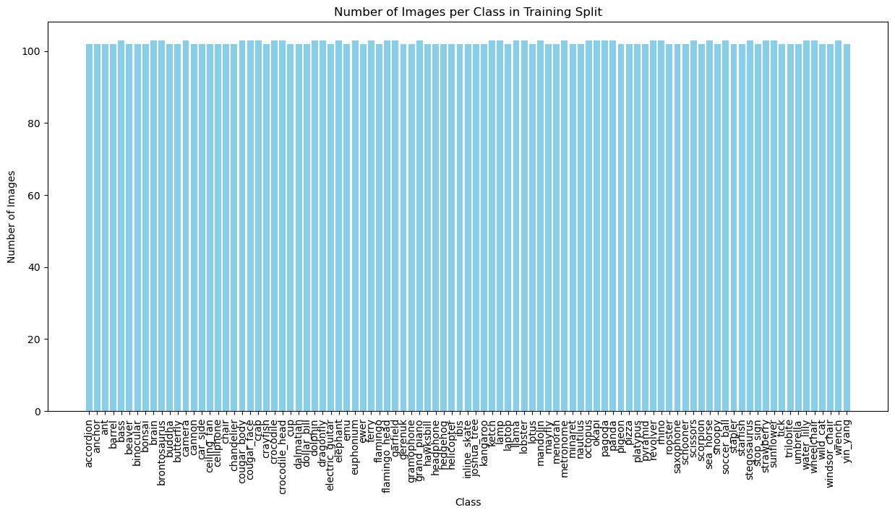
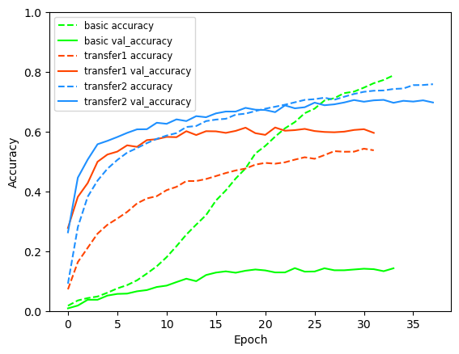
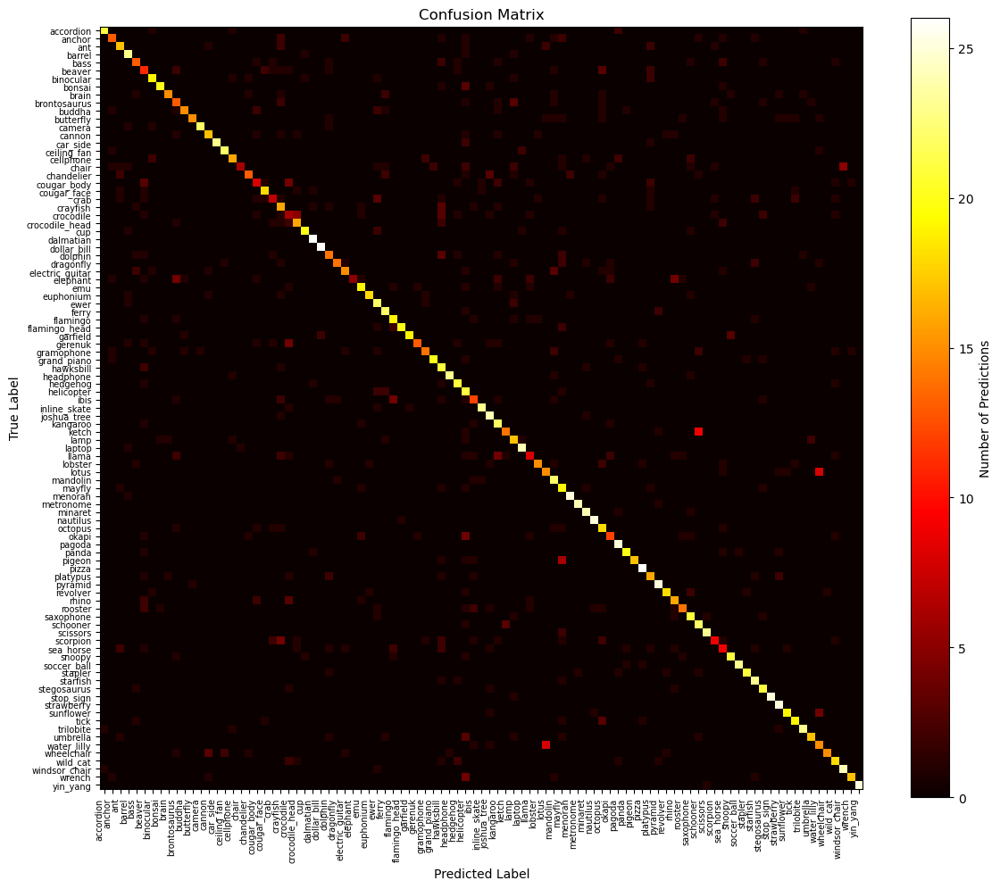
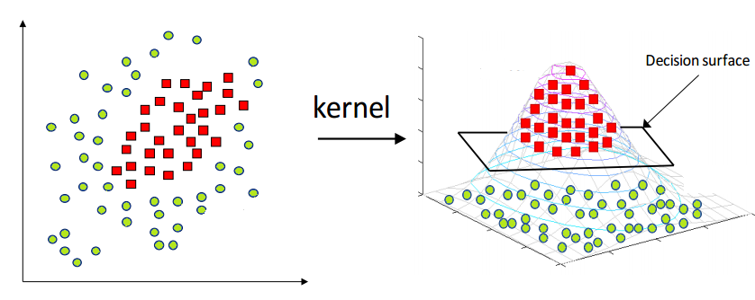

# Image Classification Using Machine Learning on the Caltech 101 Dataset

**<u>  
</u>**

**<u>Abstract</u>**

This project explores using different machine learning models for image
classification. Specifically, the differences and similarities between
Support Vector Machines and Convolutional Neural Networks. The dataset
chosen for this task is the Caltech-101 dataset. There is a large
imbalance of the number of images per class, so I excluded the extremes
and balanced the rest. The Convolutional Neural Network had much higher
performance, achieving a far higher accuracy of 69.4% in only 7 minutes
and 20.6 seconds compared to the Support Vector Machine which achieved
21.5% accuracy in 31 minutes 41 seconds. The CNN took longer to
configure to get good results however, the SVM took longer to get any
results at all.

**<u>Background and Problem to be Addressed</u>**

For this assignment, I chose to train two machine learning models on the
Caltech-101 dataset \[1\]. This is a dataset consisting of 101 different
image classes, most of which are animals, instruments or other common
objects. The two models I chose to train are a Convolutional Neural
Network and a Support Vector Machine for classification. The reason I
have chosen this dataset is because it has diverse categories and is a
manageable size. It’s not so big that the training takes too long and
not so small that it’s too easy for the models. I wanted to choose a
bigger dataset than some of the ones we have been using in the labs so I
can utilise some of the techniques from the lectures like SoftMax
activation for multiclassification.

**<u>Exploratory Data Analysis</u>**

In total, the dataset has 8677 images and no exact duplicates. I checked
for duplicates by simply hashing each image, adding them all to a list
and looping through them all to check if each one already exists. There
are some similar images within the classes, however I created a data
augmentation \[2\] pipeline which creates more similar images, so it
would be pointless to remove similar images that aren’t exact
duplicates. The image below shows a bar chart of the number of images
per class.

As you can see, the top six classes have a disproportionately high
number of images compared to the rest of the dataset so for
practicality, I excluded them from the training. Keeping the
overrepresented classes may have introduced bias towards them. If I had
balanced the dataset using data augmentation whilst keeping them, the
other classes would have needed so many images generated, it would
require too much more training time and RAM whilst maybe not even
increasing the accuracy. These are some of the images from the dataset.

**<u>Data Pre-Processing and Feature Selection</u>**

Finding the most appropriate method of feeding the data to the model was
very important for this project. I tried multiple methods and had to go
back and forth many times after encountering lots of problems. Each
method had different pros and cons. The first method I tried, was
creating a data loader module that loaded each image to memory, storing
their RGB values in a NumPy array. This worked very well at first,
because my model trained quickly and everything worked as expected, but
once I decided to generate more images to balance the dataset, I started
to run out of memory. To combat this, I realised I could store my images
using 16 bit floats instead of the default 32 bit floats without any
data loss. Even 8 bit floats could have worked without data loss
however, NumPy only supported 16 bit floats, so I just stuck with that
for simplicity.

Another method I tried was
using tf.keras.preprocessing.image_dataset_from_directory, which creates
a tf.data.Dataset. This dataset can be fed directly into model.fit. I
also experimented with tf.keras.preprocessing.image.ImageDataGenerator,
which generates augmented data dynamically and uses
the flow_from_directory function to create a generator for the model.
Both of these methods work similarly, in that the image loading and
augmentation are done as the model trains which means that the training
process was much slower overall, because the bottleneck shifts from the
model's computational speed (driven by my GPU) to the time taken for
data loading from my hard drive and augmentation done by the CPU between
epochs. I had spent a while configuring TensorFlow to use my GPU, so I
wanted to utilise its high performance as they are optimised for machine
learning. However, the advantage of using these methods is that because
you are not loading the whole dataset into memory at once, you can work
with much larger datasets. Overall, the training was taking
approximately ten times slower this way than loading everything into
memory. As a result, I decided to abandon this approach and focused on
optimising memory usage while preloading the dataset instead.

For my data augmentation, I shifted, zoomed, flipped horizontally and
rotated the images. This meant that the features the models capture
remain prevalent. The RGB values were stored using 8 bit colour depth,
so the values were between 0 and 255. Normalising them between 0 and 1
helped improve stability during training, preventing issues like
exploding or vanishing gradients. As mentioned before, I chose to
exclude some classes that had a disproportionate number of images due to
resource and time constraints. Below is a bar chart showing the number
of images per class after balancing. The reason for balancing the data
in the first place is so that no one single class is under or
overrepresented, causing bias towards certain classes \[3\].

**<u>Machine Learning Model \#1 – Convolutional Neural Network</u>**

I decided to use a convolutional neural network \[4\] for my first model
as they are state of the art for image classification, and we have been
studying their intricacies in class. CNNs are highly customisable in
terms of their layer architecture allowing them to be tuned for each
dataset.

I started off by configuring a basic CNN model. This model included a
single convolutional layer to learn basic features from the images,
followed by max pooling to reduce the dimensionality of the outputs and
simplify the data the next layers would process. I also included batch
normalisation, which helps to stabilise training by normalising the
activations of neurons between 0 and 1 within each batch and possibly
speeding up convergence of the loss function which I set to sparse
categorical cross entropy. This general architecture is quite common in
many image classification models, and I thought it would provide a solid
starting point. After these layers, I used a flattening layer to prepare
the outputs for the fully connected layers. The dense layer I used had
512 nodes, and I added dropout to deactivate some neurons during
training to help prevent overfitting.

Unfortunately, this initial model performed poorly. It achieved an
evaluation accuracy of only about 13%. Looking at the training graph,
the validation accuracy plateaued at around 12%, while the training
accuracy kept increasing and eventually surpassed 90%. This was a clear
indication of overfitting \[5\]. Essentially, the model was learning the
training dataset too well but wasn’t complex enough to learn the correct
features to generalise to unseen data. With 95 classes in the processed
dataset, it was obvious that this model was too simple to extract
meaningful patterns from the images.

After this, I decided to use pretrained models to see if transfer
learning could improve the results. I started with VGG16 \[6\], a
well-known 16-layer CNN model that was pretrained on the ImageNet \[7\]
dataset, which contains over 14 million images. Since the Caltech-101
dataset contains many classes that overlap with ImageNet, I thought this
model would already have learned useful features for my dataset.
Initially, I froze the base layers of VGG16 to keep the setup simple and
added my own custom layers on top. These included a flattening layer to
prepare the outputs for dense layers, followed by a dense layer to
combine the patterns the base model identified and determine which
features were most relevant for my dataset because ImageNet has many
features that are not relevant. I also added dropout here to help
mitigate overfitting \[8\].

For training, I included a few callbacks to make the process more
efficient. I used early stopping to terminate training early if the
validation accuracy stopped improving, which prevented unnecessary
training epochs. I also saved the model weights from the epoch of the
highest validation accuracy, so I could easily restore the best
performing version later. Lastly, I used a learning rate scheduler \[9\]
to reduce the learning rate whenever the validation accuracy stopped
improving. This is helpful because when the learning rate is too high,
the optimiser might skip over the optimal solution. Reducing the
learning rate allows the optimiser to make finer adjustments to the
weights, improving convergence.

Initially, I didn’t get great results with the pretrained model, but
after tweaking the layers and adjusting the number of neurons in each
dense layer, I started to see better performance. I found that adding
additional dense layers and dropout increased the complexity of the
model, improving its ability to select the most useful features it had
learned. I also learned that it’s common to inversely adjust the
learning rate when changing the batch size—for example, doubling the
batch size and halving the learning rate. These adjustments helped
fine-tune the model and achieve better results.

In this image, “basic” refers to the first and most simple model,
“transfer1” is the transfer learning model with only a few added layers
on top and “transfer2” is the transfer model with even more layers
added.

Confusion matrix showing the results of the classification for each
class:

**<u>Machine Learning Model \#2 – Support Vector Machine</u>**

For my second choice, I decided to use a Support Vector Machine \[10,
11\]. SVMs can be used for either classification or regression, but for
this task, I used classification since the goal was to identify the 95
image classes (Excluding the 6 classes with a disproportionate number of
images). SVMs typically have good performance on smaller datasets like
Caltech-101 and work by optimising a decision boundary \[12\] to
separate the classes.

I initially tried using a linear kernel which projects data into higher
dimensions, allowing them to be linearly separable like in the figure
\[13\] below:

However, it wasn’t giving good evaluation accuracy, so I tried radial
basis function (RBF) instead. I chose to use the RBF kernel because of
the number of classes and the complexity of the dataset. Whilst the RBF
kernel also projects data into higher dimensions, the difference is that
it uses a non-linear transformation to create curved decision boundaries
rather than a flat one like in the image above. After switching to RBF,
I also set the maximum iterations parameter to 5000 to limit the
training time because training was taking way too long and for some
reason on windows, even with verbosity set to true there was no logging,
so I had no way of knowing if the model was close to finishing its
training. On mac I could see the logging, but it was impractically slow.
I ended up using scikit-learn’s Pipeline \[14\] class combined with SVC
\[15\] to get the training working, as I also tried using liblinear, but
the training seemed to be taking forever without any improvement.

To keep everything consistent across my models, I used the same image
loading and augmentation module as I did for the CNN. By balancing the
classes, the SVM was better able to generalise across all categories, as
the decision boundary wasn’t biased towards the majority classes.

It took 31 minutes 41 seconds to train the SVM and 15 minutes 11.5
seconds to evaluate. A major difference between the two models is that
the evaluation took extremely long for the SVM compared to the CNN.
These are the results from the SVM:

| Accuracy              | 21.54% |
|-----------------------|--------|
| Misclassified samples | 1908   |
| Total samples         | 2432   |

Overall, the SVM performed quite poorly, and the implementation was
tedious. I think due to the very high number of classes, the model
struggled. Also, the fact that the input pixels had to be flattened, the
model can lose sense of special relationships and features.

**<u>Results Comparison</u>**

Model results comparison table:

| Model | Training Time (Real time) | Training Time (Epochs) | Evaluation Time | Accuracy (%) | Misclassified Samples out of 2432 total |
|----|----|----|----|----|----|
| SVM | 31 minutes 41 seconds | N/A | 15 minutes 11.5 seconds | 21.54 | 1908 |
| Basic CNN | 4 minutes 42.4 seconds | 34 | 1.1 seconds | 12.58 | 2,126 |
| First VGG16 CNN | 6 minutes 3 seconds | 32 | 3.6 seconds | 59.33 | 989 |
| Second VGG16 CNN with added layers | 7 minutes 20.6 seconds | 38 | 3.4 seconds | 69.40 | 744 |

The SVM definitely proved to be the worst as it had the slowest training
time and also a low accuracy score. The epoch time in seconds can vary
so it is not a good measure of performance to compare.

**<u>Conclusion, Recommendations, and Future Work</u>**

**Conclusion**

In conclusion, the CNN significantly outperformed the SVM in terms of
accuracy and efficiency but was more complicated to configure to get
good results. The CNN was extremely sensitive to changes in layers and
hyperparameters \[16\]. For example, there were a few times where adding
additional blocks of layers actually decreased the accuracy of the model
instead of increasing it even though the model is theoretically more
complex. The same sensitivity occurred with learning rate, where if it
was too large, a global or local minimum value of the loss function
would be skipped meaning the accuracy would not increase. Also setting
the dropout rate too high could deactivate too many neurons, leading to
under-representation of features.

In contrast the SVM was much easier to configure as there are a lot less
variables, however getting it to actually work proved difficult due to
the lack of logging and long processing times. Balancing the classes was
an important step to improving the accuracy of both models, before I
balanced the classes, the accuracy was far lower.

**Recommendations and Future Work**

Principal Component Analysis (PCA) \[17\] is something I would have
liked to explore further to see if using it to reduce my data’s
dimensions would have increased the accuracy or decrease training times.
I did attempt to add this into my data preprocessor; however, I did not
have enough RAM. When running the transformations I kept getting memory
errors. I tried to get around this by running the transformation in
batches but got the same problem.

t-Distributed Stochastic Neighbour Embedding (t-SNE) \[18\] is another
technique that could prove useful for visualising my dataset. It could
possibly link to deciding which kernel to use for my SVM. For example, a
t-SNE visualisation could show features in simplified dimensions, which
have easy to spot separability like the image in my SVM section.

There are other more complex pretrained models \[19\] that I tried but
couldn’t get as high accuracy on such as ResNet50 and EfficientNet,
probably due to the sensitivity of hyperparameters and freezing of
certain layers. Future investigation could be done on other pretrained
models to compare their accuracies.

**<u>References</u>**

\[1\] Bansal, M., Kumar, M., Sachdeva, M. and Mittal, A., 2023. Transfer
learning for image classification using VGG19: Caltech-101 image data
set. Journal of ambient intelligence and humanized computing, pp.1-12.

\[2\] Taqi, A.M., Awad, A., Al-Azzo, F. and Milanova, M., 2018, April.
The impact of multi-optimizers and data augmentation on TensorFlow
convolutional neural network performance. In *2018 IEEE Conference on
Multimedia Information Processing and Retrieval (MIPR)* (pp. 140-145).
IEEE.

\[3\] Mooijman, P., Catal, C., Tekinerdogan, B., Lommen, A. and
Blokland, M. (2023). The effects of data balancing approaches: A case
study. Applied Soft Computing, 132, p.109853.
doi:https://doi.org/10.1016/j.asoc.2022.109853.

‌‌\[4\] Hasan, M.M., Azmain Yakin Srizon, Sayeed, A. and Mehedi, A.
(2021). High Performance Classification of Caltech-101 with a Transfer
Learned Deep Convolutional Neural Network. \[online\] pp.35–39.
doi:https://doi.org/10.1109/icict4sd50815.2021.9396917.

\[5\] Ying, X., 2019, February. An overview of overfitting and its
solutions. In *Journal of physics: Conference series* (Vol. 1168, p.
022022). IOP Publishing.

\[6\] Simonyan, K. and Zisserman, A. (2015). VERY DEEP CONVOLUTIONAL
NETWORKS FOR LARGE-SCALE IMAGE RECOGNITION. \[online\] Available at:
https://arxiv.org/pdf/1409.1556.

\[7\] Deng, J., Dong, W., Socher, R., Li, L.J., Li, K. and Fei-Fei, L.,
2009, June. Imagenet: A large-scale hierarchical image database. In 2009
IEEE conference on computer vision and pattern recognition (pp.
248-255). Ieee.

\[8\] Park, S. and Kwak, N., 2017. Analysis on the dropout effect in
convolutional neural networks. In *Computer Vision–ACCV 2016: 13th Asian
Conference on Computer Vision, Taipei, Taiwan, November 20-24, 2016,
Revised Selected Papers, Part II 13* (pp. 189-204). Springer
International Publishing.

\[9\] Yedida, R. and Saha, S., 2019. A novel adaptive learning rate
scheduler for deep neural networks. *arXiv preprint arXiv:1902.07399*.

\[10\] Hearst, M.A., Dumais, S.T., Osuna, E., Platt, J. and Scholkopf,
B., 1998. Support vector machines. *IEEE Intelligent Systems and their
applications*, *13*(4), pp.18-28.

\[11\] Suthaharan, S. and Suthaharan, S., 2016. Support vector
machine. *Machine learning models and algorithms for big data
classification: thinking with examples for effective learning*,
pp.207-235.

\[12\] www.eric-kim.net. (n.d.). The Kernel Trick. \[online\] Available
at: http://www.eric-kim.net/eric-kim-net/posts/1/kernel_trick.html.

‌\[13\] Wolpe, Z. (2022). Domain Generalisation - Zach Wolpe - Medium.
\[online\] Medium. Available at:
https://zachcolinwolpe.medium.com/domain-generalisation-500f6bbc0977
\[Accessed 3 Dec. 2024\].

\[14\] scikit-learn. (2024). Pipeline. \[online\] Available at:
https://scikit-learn.org/1.5/modules/generated/sklearn.pipeline.Pipeline.html.

‌\[15\] scikit-learn. (2024). SVC. \[online\] Available at:
https://scikit-learn.org/1.5/modules/generated/sklearn.svm.SVC.html#sklearn.svm.SVC.

‌\[16\] Tuba, E., Bačanin, N., Strumberger, I. and Tuba, M., 2021.
Convolutional neural networks hyperparameters tuning. In *Artificial
intelligence: theory and applications* (pp. 65-84). Cham: Springer
International Publishing.

\[17\] Abdi, H. and Williams, L.J., 2010. Principal component analysis.
Wiley interdisciplinary reviews: computational statistics, 2(4),
pp.433-459.

\[18\] Van der Maaten, L. and Hinton, G., 2008. Visualizing data using
t-SNE. Journal of machine learning research, 9(11).

\[19\] Hasan, M.M., Srizon, A.Y., Sayeed, A. and Hasan, M.A.M., 2021,
February. High performance classification of caltech-101 with a transfer
learned deep convolutional neural network. In 2021 International
Conference on Information and Communication Technology for Sustainable
Development (ICICT4SD) (pp. 35-39). IEEE.
